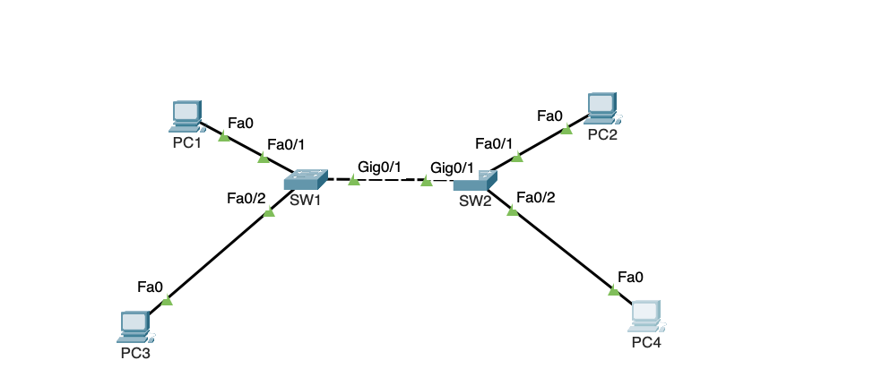

# VLAN and Trunk Configuration



---

## 📝 Objective

This lab demonstrates how to configure VLANs and trunk links between two switches. The goal is to segment the network for better management and security by assigning VLANs to ports and enabling trunking on the inter-switch link.

---

## 📦 Initial Packet Tracer File

You can download the full Packet Tracer solution file here:

👉 [Download Lab1InitialSetup.pkt](./Lab1InitialSetup.pkt)

---

## 📝 Task List

1. Assign the hostnames to the switches
2. Plan for a subnet to use of each VLAN (10 and 20)
3. Assign the PCs belonging to VLAN 10 an IP address in the same subnet. 
4. Configure all the ports that have devices connected to them the appropriate port type and VLAN (access or trunk port)
5. Make sure the ports are correctly configured by trying different pings from different hosts where PCs in the same VLAN should be able to ping each other and PCs in different VLANs SHOULD NOT be able to ping each other. 

---

## ✅ Configuration Steps 

> **Configuration Note:** 
You will need to be in configuration mode to execute all of the configuration commands (> enable > conf t). For the show commands you will need to be in privilege exec mode (> enbable) OR you can use `do` in front of the show command to do it in configuration mode. 

1. **Assign the right hostname to the switches**  
   ```bash
   hostname SW1
   hostname SW2
   ```

2. **Assign VLANs and IP addresses**  
   - VLAN 10: PC1 (192.168.10.2/24 255.255.255.0) and PC2 (192.168.10.3/24 255.255.255.0)  
   - VLAN 20: PC3 (192.168.20.2/24 255.255.255.0) and PC4 (192.168.20.3/24 255.255.255.0) 

3. **Configure Access Ports**
   ```bash
   interface fa0/1
   switchport mode access
   switchport access vlan 10
   ```
> **VLAN Creation Note:** 
Although this approach works, it is better to create the VLANs before assigning them to a specific port. This way you can also give the VLANs a name which will help you later on during troubleshooting. 


4. **Configure Trunk Port**
   ```bash
   interface gig0/1
   switchport trunk encapsulation dot1q
   switchport mode trunk
   ```

5. **Verify Configuration**
   ```bash
   show vlan brief
   show interfaces trunk
   ```

6. **Save Configuration**
   ```bash
   write memory
   ```

---

## 🧪 Testing and Verification

- ✅ **Ping** between PCs in the same VLAN (PC1 and PC2 or PC3 and PC4) to verify communication
- ❌ **Ping** between different VLANs (e.g. PC1 and PC3 or PC2 and PC4) should fail without routing
- 🛠️ Use `show mac address-table` to confirm dynamic learning
- 🔍 Validate trunking with `show interfaces trunk` output

---

## 📦 Solution File

You can download the full Packet Tracer solution file here:

👉 [Download Lab1Solution.pkt](./Lab1Solution.pkt)